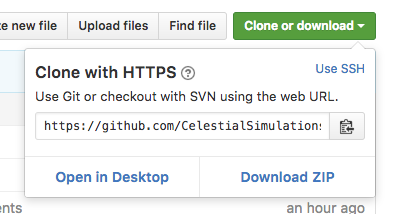

# Light Speed Simulation

Welcome space programming cadets! Your mission is to create a ship that can weather harsh space conditions
without burning up, avoid destruction, and most of all, achieve the highest possible speed... Even faster than
lightspeed! You have the following tools available to you:

```
shipname.build();
shipname.fly(rate, rmillis);
shipname.burn();
shipname.destroy();
```

* `shipname` is just a placeholder for what you want to call the ship.
* `build()` is used to create the shape of the ship.
* `fly(rate, rmillis)` is used to make the ship fly at a certain rate. You can define the rate, but it must
always have a second parameter called `rmillis`.
* `burn()` BURNS the ship.
* `destroy()` DESTROYS the ship.

You can use burn and destroy to test your ship under different conditions. Speaking of conditions, to
make your ship effective, you will need to realize what your ship will be able to take, and state that
condition in your program. For a rocket, you could do some research how much pressure it can take when
going at a certain speed, and use `shipname.burn()` as a warning. Or you could just go wild and create
a very interesting ship. Anyways, in order to create such condition, you will need an **'if statement'**.
An 'if statement' looks like this in code:

```
if (something happens) {
  do something
}
```

In our case, 'something happens' could be when our rocket's rate is above a dangerous rate of 150000 miles per
second. 'Do something' would be rocket.burn(); (assume that the ship's name is rocket). So overall, the
if statement could look like this:

```
if(rocketRate > 150000) {
  rocket.burn();
}
```

rocketRate is the rate of the rocket as a variable, which *stores* a value. This is useful for when you
want the rate of the rocket to change and apply conditions to it. So the original rocketRate could be
100000, but we programmed it to increase. This can be seen in action in the code, but it looks like this:

```
rocketRate = rocketRate + 1000;
```

where it's accelerating at 1000 miles. rocketRate would go into `fly(rocketRate, rmillis)`.

## Creating a Ship
You will need to initialize and declare your ship first before you can use these tools.

1. [Declare](#declare)
2. [Initialize](#initialize)
3. [Draw](#draw)

### Declare
Above void shipSetup, to declare your ship, write:

```
flying_obj shipname;
```

### Initialize
To initialize your ship, in `void shipSetup`, you will need to write:

```
shipname = new flying_obj(default position, name of image for ship);
```

'default position' is the starting point of the ship, and you can use mercuryX, venusX, earthX, etc. to assign
your ship to a planet to start on, but it could be any number. 'name of image for ship' must be a name that you
have in the images inside the svgs folder. For example, it could be "rocketship", as one of the images is called
rocketship. Note that it will need to be in quotes.

### Draw
In `void ships`, you will be able to use your tools and statements. An example of a single ship could look like
this in the code:

```
flying_obj myship;

void shipSetup() {
  myship = new flying_obj(jupiterX, "star-wars-falcon");
}

void ships() {
  myship.build();
  ...
}
```

And this can be used to create a single ship. However, many more can be created! Just repeat the steps.

## Getting the Code...
This is fairly simple, you can simply download it or clone it, if you like.

1. [Downloading it](#downloading)
2. [Cloning it](#cloning)

### Downloading

Simply find this button,



and click Download Zip.

### Cloning

If you choose to use git, then you'll first to want to open Terminal. Search Terminal on your computer
and open it. Type:

```
cd Documents
```
and hit enter to navigate to the Documents folder within Terminal (it's just like the Finder). Then you'll want to
type in the following git command. You can just copy and paste the entire block and hit enter. Git will
do the work for you. Believe in Git.

```
git clone https://github.com/CelestialSimulations/Light-Speed-Sim.git
```
It should appear in Documents folder quickly.

You should rename your folder so you know it's yours. Now, double click on the folder called Light-Speed-Sim, and
then navigate to the folder light_speed. Double click on **light_speed.pde**. It will open up a code file in an
application called Processing 3. Navigate to the **ships** tab. This is where your adventure as a space programming
cadet will begin.


